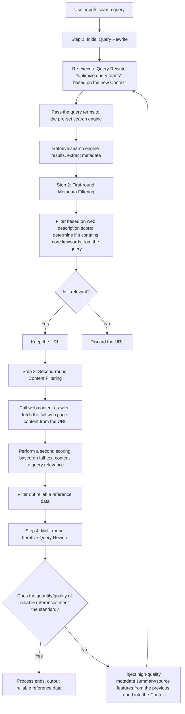
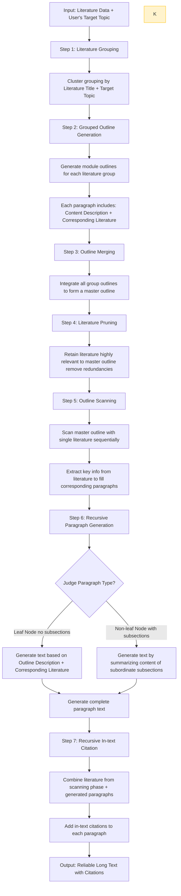
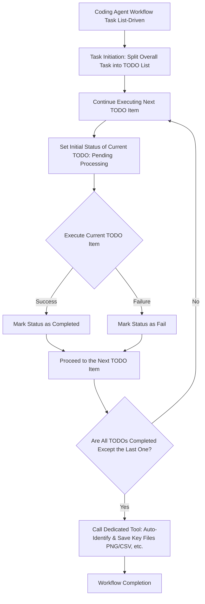

# Agent 设计经验总结

# 引言

从开始真正接触 Agent 设计至今，已经过去了三个月。在这段时间里，我设计了多个具备产品化潜力的 Agent，例如搜索 Agent（Search Agent）、写作 Agent（Writing Agent）以及编码 Agent（Coding Agent）。在设计过程中，我不仅积累了大量实践经验，也产生了许多深刻感悟，其中最核心的一点是：一个真正可用、可靠的 Agent，关键由两方面要素决定。

*   **模型选择是 Agent 系统的驱动核心**：没有模型的驱动，Agent 系统就如同没有添加燃料的汽车，只是一个无法运转的空壳；即便有了模型，如果模型性能不佳（即 “燃料质量不好”），Agent 系统同样无法稳定、高效地完成任务。

*   **Context（上下文）注入对提升 Agent 系统性能至关重要**：以编码 Agent 为例，为其提供必要的工具上下文（Tools Context）、规划上下文（Planning Context），能显著增强它的编码与执行能力；再以搜索 Agent 为例，在任务执行过程中持续将搜索源信息注入到其上下文当中，能有效优化查询重写（Query Rewrite）的效果。需要注意的是，Context 的设计需经过精心考量：一方面，它要能引导模型更精准地生成符合预期的下一步输出（Next Tokens）；另一方面，它需对模型所需处理的数据进行压缩与精简，这能大幅降低模型产生 “幻觉”（输出错误或无依据信息）的概率 —— 尤其在写作 Agent 的长文本生成逻辑中，我正是采用了以大纲（Outline）为指导、以树状结构为基础的自底向上递归遍历生成方式，通过合理的 Context 设计保障了长文本生成的质量与准确性。

在本文中，我将分享我对 AI Agent 的理解，以及如何基于 Agent 的设计理念打造上述提到的Search Agent、Writing Agent 与Coding Agent。全文不会涉及具体代码与 Prompt 编写，仅聚焦于实践沉淀的方法论与工具使用经验。

# 我眼中的 Agent？

在我看来，基于大语言模型（LLM）驱动的 Agent，本质上与软件工程中的 “设计模式” 类似 —— 它是一种经过验证、可复用的任务执行范式。

*   例如**反应式 Agent（React Agent）**，就是一种常用的设计范式：它允许 Agent 与外部环境进行交互，并通过调用工具来逐步推进任务完成，整个过程具备 “感知 - 决策 - 执行” 的闭环特性。

*   再如**人机协同（Human-in-the-Loop）设计模式**：这种模式允许人类在 Agent 执行任务的关键步骤中参与决策，共同判断下一步操作方向。典型案例包括 Cursor 编辑器、Claude Code 等工具，它们在执行某些关键操作前会主动询问用户 “是否确认执行下一步”，通过人机配合进一步提升任务结果的准确性。

此外，Agent 从根本上解决了传统程序中的 “硬编码问题”：在传统代码开发中，我们常常需要在特定环节编写硬编码的判断规则（如使用 if-else、switch-case 等条件语句）；而有了 Agent 后，这些判断规则可以交由 Agent 自主分析与决策，无需人工预先编写固定逻辑，极大地提升了系统的灵活性与适应性。

# 从简单 Agent 到复杂 Agent 的构建演进路径

一个最简单的 Agent，往往始于一段 Prompt（提示词）。这段 Prompt 通常包含角色设定，核心作用是引导大语言模型（LLM）朝着特定方向生成内容 —— 这正是提示词工程（Prompt Engineering）的起源。这种基础形态的 Agent 虽能完成单一、简单的任务，但存在明显局限：它没有上下文记忆能力，每轮对话结束后，Agent 的生命周期便随之终止，无法基于历史交互信息持续推进任务。

为解决记忆缺失的问题，“模型记忆” 概念被引入，并进一步细分为**短期记忆**与**长期记忆**：短期记忆可类比计算机的 “内存机制”，仅在单个对话会话（Session）内临时维持，支撑本轮任务的上下文连贯性；长期记忆则类似计算机的 “磁盘存储”，能将信息持久化保存，在需要时从存储中调取数据，注入模型上下文以辅助回答。这一逻辑也正是我们常说的**RAG 技术（检索增强生成）** 的核心 —— 将海量数据存储于外部数据库，在任务执行过程中按需检索相关信息，补充到模型上下文窗口，从而大幅提升生成内容的准确性与相关性。

至此，Agent 已具备 “记忆能力” 与 “外部信息获取能力”，但仍存在关键短板：它无法调用外部工具解决现实场景中的交互类问题。为此，**Tool Calls（工具调用）** 概念应运而生。Tool Calls 允许 Agent 根据当前任务需求，自主判断是否调用外部工具，并通过工具获取精准结果。例如，当用户提问 “1+1 等于多少” 时，无工具的 Agent 可凭借训练数据直接生成 “2” 的答案；但面对超大数字运算（如 “123456789×987654321”），仅靠模型预测极易出现 “幻觉”（输出错误结果）。尽管可通过在 Prompt 中加入 “分步推理（Think Step by Step）” 引导模型逐步计算，但准确性仍无法保证。而 Tool Calls 能完美解决这一问题：若为 Agent 配置 “计算器（Calculator）” 工具，它会先将用户的运算需求转化为可解析的数据格式（如 JSON 参数），调用计算器工具执行运算，再基于工具返回的可靠结果，以自然语言向用户输出准确答案。

此时的 Agent 已具备 “记忆 + 工具调用” 的核心能力，理论上可应对多数常规任务，但面对**复杂任务**）仍显乏力 —— 这类任务需拆解为多个连续步骤，单一 Agent 难以按序推进并保障每一步的质量。为此，**React Agent** 应运而生：它通过 “推理 - 调用工具 - 获取结果 - 再推理” 的循环机制，根据任务复杂度动态拆解步骤，逐步推进任务，最终输出完整的复杂任务解决方案。从理论上讲，只要模型足够强大、工具库足够丰富，React Agent 几乎可覆盖所有任务场景。但在当前技术阶段，React Agent 仍存在瓶颈：一方面，模型的上下文窗口容量有限，无法承载超长篇幅的任务信息和推理信息；另一方面，即便信息未超出窗口容量，过长的上下文也可能导致模型注意力分散，增加 “幻觉” 概率，最终导致任务执行失败。

基于上述局限，**多 Agent 协同（Multi-Agent Collaboration）** 成为当前 Agent 发展的重要方向。其核心逻辑是：Planner Agent将复杂任务拆解为多个子任务，为每个子任务配置专属 Agent（即 “分工专业化”），并通过预设的信息传递机制与数据结构，实现 Agent 间的高效协作，形成 “多 Agent 工作流”。例如，我目前设计的Agents有如下：负责 “检索并过滤数据以获得可靠文” 的**Search Agent**、负责 “整合数据、撰写报告、添加引用源” 的**Writing Agent**、负责 “数据分析，评估结果，代码编写和解读” 的**Coding Agent**。通过三者的协同配合，既能规避单一 Agent 的能力短板，又能通过专业化分工提升每个子任务的执行质量，最终保障复杂任务的整体可靠性。

接下来，我将具体拆解 Search Agent、Writing Agent 与 Coding Agent 的设计逻辑，以及实践中沉淀的部分技术细节。每个 Agent 我都会从三个核心维度展开：一是 Agent 本身的核心职能定位，二是它内部完整的工作流转过程，三是 Context 的设计思路与关键技术细节，确保把设计里的关键逻辑讲透。

### Search Agent 构建

Search Agent 光看名字就知道它的核心作用 —— 专门负责信息检索，最终输出可靠、可用的搜索数据。搭建这个 Agent 有两个核心问题必须要解决

第一个是**搜索问题**：得明确 Agent 面对不同需求时，该用什么样的搜索策略去查文献？比如是拆成多个关键词搜，还是按主题拓展搜？更关键的是，要从哪些渠道拿数据？不同场景对应的数据源头完全不一样，不能乱选。

第二个是筛选机制：搜回来的数据肯定有好有坏，Agent 得有能力自己判断这条数据是否符合用户的需求，还得有明确的机制把没用的、低质的数据筛掉，只留下核心有用的。

### Search Agent 工作流程

我设计的这个 Search Agent，整个工作流程核心是 “**靠 Context 驱动的 Query Rewrite（查询重写）+ 两层递进式过滤**”，每一步都衔接得很紧密，具体是这么走的：

第一步，**初始查询优化（无状态阶段）**：当 Agent 刚接到用户的搜索需求时，它是 “空的”—— 没有任何历史搜索信息，也就是 “无状态” 的。这时候它会先对用户的原始问题做 Query Rewrite，把模糊的需求拆成多个查询关键词或短句。然后把这些查询词传给提前配置好的 “搜索引擎”。传完之后，搜索引擎会返回一堆结果，里面能提取出不少元数据，像 URL 链接、网页摘要（web description）、网页标题（web title）这些关键信息都会拿到。

第二步，**首轮元数据初筛**：拿到这些元数据后，Agent 会先做第一次打分过滤。这次过滤不深入看网页内容，就靠简短的 web description 来判断 —— 比如看摘要里有没有提到用户需求里的核心词，评估这个 URL 对应的内容是不是用户真正需要的。如果判断是 “相关”，就把这个 URL 留下来；要是明显不相关，直接剔除。

第三步，**次轮内容精筛**：通过初筛的 URL 会进入第二轮更严格的过滤。这时候 Agent 会调用 web content crawler，把每个 URL 背后的完整网页内容都爬取下来。然后 Agent 会根据 “全文内容与用户需求的匹配度”再打一次分，最后留下的就是相对靠谱的文献数据了。

第四步，**多轮迭代优化（有状态阶段）**：要是第一轮筛选完，发现可靠文献的数量不够，或者质量没达到预期，Agent 就会进入 “有状态” 模式 —— 把上一轮拿到的有用元数据（比如优质网页的摘要、靠谱来源的特征）塞进下一次 Query Rewrite 的上下文窗口里。这样一来，下一次的查询词就能更贴合需求，搜出来的结果会更精准。就这么循环迭代，直到 Agent 判断 “搜索到的数据足够用了”，才会自动停下来。

### 技术细节

在 Search Agent 的设计里，我觉得有两个点是最关键的，直接影响 Agent 的最终效果，必须重点关注：

一个是**搜索源的选择**：搜索源的选择直接决定了搜出来文献的质量。比如你想找计算机领域的学术文献，那肯定要优先对接 arXiv、IEEE Xplore 这种专门的学术数据库，要是用 Google 这种通用搜索引擎，搜出来的大多是新闻、博客，根本满足不了学术需求；再比如你想搜自己电脑文件夹里存的本地文章，那得对接本地的搜索源头。所以搜索源必须跟具体场景精准匹配。

另一个是**Context 驱动的 Query Rewrite 机制**：Query Rewrite 能不能做好，一方面看模型本身是否存在数据另一方面则是 Context 里的历史信息支撑。比如你问 Agent 一个很冷门的问题，这个知识可能不在模型的训练数据里。Agent 第一次做 Query Rewrite 时，因为没有任何 Context 参考，只能凭模糊的理解生成质量较低的查询词，搜出来的结果自然质量不高；但等它搜过一轮，把上一轮拿到的相关元数据、筛选标准注入 Context 后，再做 Query Rewrite 就能明确方向，生成的查询词会更精准，后续搜出来的结果也就会靠谱许多

# Writing Agent 构建

Writing Agent 的核心职责，就是接收来自其他 Agent（比如 Search Agent）的数据，完成各类文本的撰写工作，像报告（Report）、综述（Survey）等等。要是让它和 Search Agent 等其他 Agent 配合，最终能达到类似 Deep Research 的效果，甚至在不少场景下能远超 Deep Research 的表现。

对 Writing Agent 来说，核心要解决的问题其实就一个：利用海量的数据，生成可靠的长文本内容。毕竟如果把所有数据，比如文献，一次性传给它，让它直接生成长文章，从实际操作来看几乎是不可能的事。

## Writing Agent 工作流程

Writing Agent 拿到的核心数据，主要是文献数据和用户提供的一些人工素材（Artifact）。这里先不讨论人工素材 —— 涉及它的流程会更复杂，咱们只聚焦以 “文献数据为核心” 的写作流程。

### 第一步：文章分组

首先，Writing Agent 会根据两方面信息对搜索到的文献进行分组聚类：一是文献元数据（Metadata）里的标题（Title），二是用户指定的待写文章主题（Topic）。这一步的目的很明确，就是提前对文献做分类整理，为后续生成分组大纲做好准备。

### 第二步：分组大纲生成

接下来，Writing Agent 会针对每一组聚类好的文献，分别生成对应模块的文章大纲。而且这个大纲里的每个段落，都会包含两个关键信息：一个是该段落的核心内容描述，另一个是支撑这个段落所需的文献。这么做，一方面是提前明确段落的核心方向，另一方面也是同步提取对应的文献引用，避免后续写作时遗漏。

### 第三步：合并大纲

这一步要做的，就是把前面生成的各组大纲进行整合，最终形成一篇完整的、待写文章的总大纲。

### 第四步：文献剪裁

在这一步，Writing Agent 会筛选出后续写作真正需要用到的文献 —— 只保留和大纲内容强相关的文献，其余无关或关联度低的文献则直接剔除，避免冗余文献占用资源。

### 第五步：扫描大纲

之后，Writing Agent 会用单篇文献逐一对总大纲进行 “扫描”。每次扫描，都会把这篇文献里的关键信息，填充到大纲中对应的具体段落里。举个例子：如果需要用到 10 篇文献，就会对大纲进行 10 次扫描，每次都把当前文献的相关内容填写到大纲的对应段落中。再具体点说，假设大纲有 5 个段落，用其中一篇文献扫描后，可能会给 0-5 个段落填充上详细内容（具体看文献与段落的关联度）。

### 第六步：递归式段落生成

到这一步，Writing Agent 就正式进入文本编写阶段了。整个编写采用的是 “树形结构自底向上的递归式流程”，核心逻辑是这样的：对一篇文章来说，每个自然段本质上都能看作一个树形结构 —— 一个主段落（Section）可能由多个子段落（Subsection）组成，而主段落的内容，往往是对下属所有子段落的总结。所以，只要先写完所有子段落，就能基于这些子段落的内容，生成对应的主段落。

具体编写时会分两种情况：

*   **叶子结点段落**：这类段落没有任何子段落，生成时主要依赖大纲（Outline）里对应的段落描述，再结合支撑该段落的文献引用具体内容，直接生成段落文本。

*   **非叶子结点段落**：这类段落有下属子段落，生成时不需要额外依赖文献，而是直接根据所有直接子段落的内容，汇总总结生成主段落文本。

这套生成机制是解决长文本写作的核心 —— 通过递归不断拆解、压缩信息，既能有效突破模型上下文窗口的限制，又能保证长文本内容的连贯性。

### 第七步：递归式文内引用

这一步和 “递归式段落生成” 逻辑类似，但核心目标不同：不再是根据子段落生成主段落，而是针对每个主段落（Section），结合 “扫描大纲阶段填充的文献” 和 “已经生成好的主段落内容”，为段落添加对应的文内引用，确保文本的学术严谨性。

## Writing Agent 的局限性说明

不过，Writing Agent 这套工作流程也不是万能的，它本质上是用一种 “启发式机制”，扩大了语言模型原本的长文本写作能力。如果文献量远超 LLM 的上下文容量 —— 比如在 “文章分组” 阶段生成了 100 组甚至更多的文献组，那后续流程就可能出问题，大概率会超过模型的上下文窗口限制。但好在这种情况很少见，即便是撰写博士论文级别的长文本，也不太会遇到这么极端的场景。

# Coding Agent 构建

Coding Agent 的核心职责的核心职责包括数据分析、数据评估、代码审查与代码生成。从设计思路来看，它本质上采用了 React Agent 的框架，能对任务进行规划，并在关键节点调用工具，逐步推进问题解决。

## Coding Agent 工具体系

Coding Agent 的工具主要分为四大类，每类工具对应特定场景需求，协同支撑任务执行：

### 1. Planning（规划）工具组

核心作用是把控任务整体进度与数据留存，包含三类工具：

*   任务拆分工具：用于创建整体任务的 TODO List，明确各阶段目标；

*   进度标记工具：在完成某个 TODO 项后，对其状态进行标记；

*   数据存储工具：专门用于保存任务过程中的重要数据，避免关键信息丢失。

### 2. OS（操作系统）工具组

聚焦文件与文件夹的基础操作，覆盖全流程文件管理需求，包括：

*   文件操作：创建、编辑、移动、查询文件；

*   文件夹操作：创建、罗列、移动文件夹等。

### 3. Execution（执行）工具组

负责运行生成的各类脚本文件，确保代码落地执行，例如：

*   执行 Python 脚本、Shell 脚本等，获取脚本输出结果。

### 4. Other（其他）工具组

涵盖辅助性操作工具，满足特定场景需求，例如：

*   包管理工具（如 pip、npm）、图表渲染工具、Git Clone 工具等。

## Coding Agent 工作流程

Coding Agent 本质是 React Agent，但整个执行过程由 “任务列表” 驱动，具体流程如下：

在任务启动初期，Agent 会先将整体任务拆分成多个 TODO 项，形成完整的 TODO List。随后，Agent 会按照 TODO List 的顺序依次执行每个任务项，且每个 TODO 项设有四种状态：Pending（待执行）、Processing（执行中）、Completed（已完成）、Fail（失败）。

当完成某个 TODO 项时，Agent 会立即更新其状态：执行成功则标记为 Completed，执行失败则标记为 Fail，之后继续推进下一个 TODO 项。

待除最后一个 TODO 项外的所有任务完成后，Agent 会调用专属工具，自动识别并保存该任务所需的重要文件（如 PNG 图表、CSV 数据文件等）。这种保存方式依赖 Agent 的自主识别能力，而非通过硬编码指定文件类型，灵活性更高。

## Coding Agent 核心注意点

在设计与使用 Coding Agent 时，有两个核心方面需重点关注：

### 1. 代码执行空间

由于 Coding Agent 会对所在沙箱（Sandbox）中的文件、文件夹进行操作，存在误删除、误修改重要文件的风险。因此，为其配置隔离环境至关重要，例如通过 Docker、Daytona 等工具搭建独立执行空间，避免对核心环境造成影响。

### 2. 工具设计

模型的上下文窗口容量有限，工具并非越多越好，而是要 “按需设计”。以代码执行为例，其中涉及到三个核心工具：

*   `create_file`：允许 Agent 创建脚本文件；

*   `execute_file`：用于执行已创建的脚本（如 Python、Shell 脚本）；

*   `edit_file`：当 `execute_file` 执行失败时，Agent 可通过该工具直接编辑脚本的指定行数，无需重新创建完整脚本，大幅减少了上下文占用，提升执行效率。

# Agent 落地搭建流程

本文所提及的 Agent 构建，核心均基于 LLM（大语言模型）实现。而 LLM 生成文本时，本质是通过概率预测下一个 Token（词元），这一特性决定了它无法百分百确保任务执行正确 —— 即便在最优场景下，单步任务的正确率可能也只能达到约 95%。

这一局限性在 “准确率要求高的场景” 中尤为明显：Agent 的执行流程由多个环节串联而成，若每个步骤的正确率均为 95%，按概率叠加计算，整体任务的成功率会远低于 95%。可以说，LLM 天然的 “概率性输出” 特性，让 Agent 系统暂时无法达到 “完美好用” 的状态，但足以实现 “基本能用” 的落地门槛。

因此，当确定 Agent 针对某一领域的具体需求后，合理的落地流程应遵循以下逻辑：

首先，搭建 Agent 的核心工作流（Workflow）；再来，选定适配的 LLM 基础模型（Foundation Model）；接着，通过测试验证这套方案能否解决该领域 **90% 以上的常规需求**—— 若能满足，便无需急于引入复杂技术，可先实现初步落地；而针对剩余 10% 的边缘需求或精度问题，再考虑采用微调（Fine-tuning）等技术进行优化。

从个人实践视角出发（暂不涉及模型训练 —— 这通常是大公司的资源密集型工作），Agent 核心落地环节并不会依赖过多的模型训练或微调技术。其关键在于 “搭建出能跑通的工作流”，先实现 “能用” 的目标；后续随着 LLM 本身能力的迭代升级，Agent 会自然向 “好用” 过渡；最后，再通过微调等手段解决边际效应问题。

简言之，Agent 落地的核心逻辑是：以工作流搭建为基础实现初步可用，依托模型自然进化提升整体效果，最终用微调补足边缘场景，而非一开始就陷入复杂的模型技术细节。

