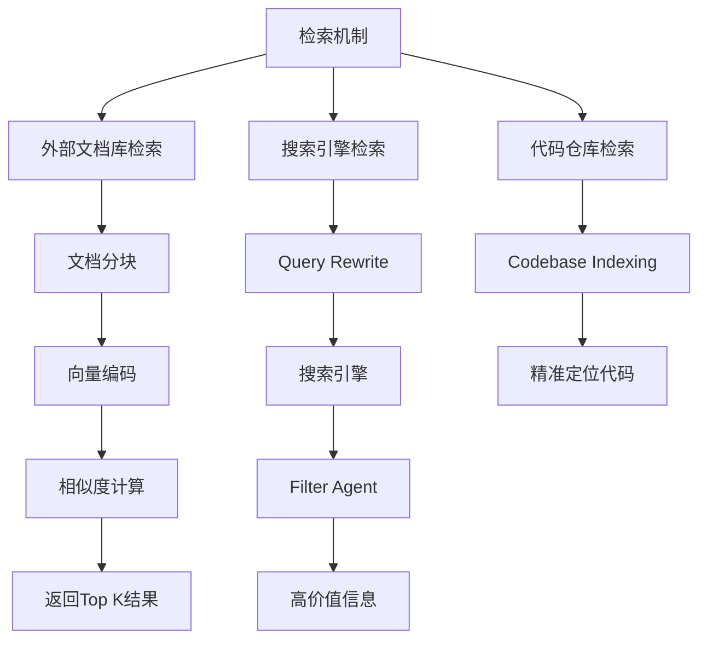
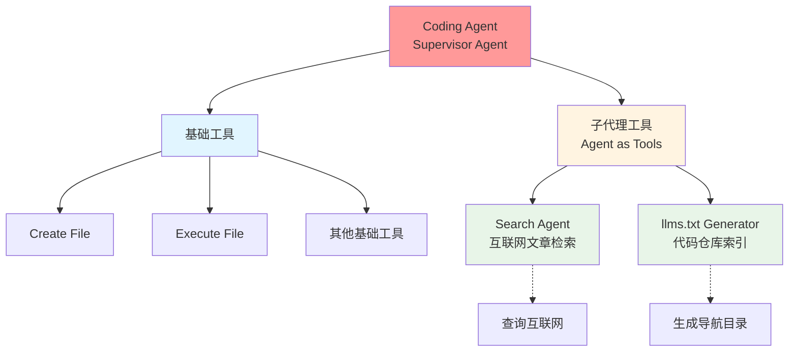
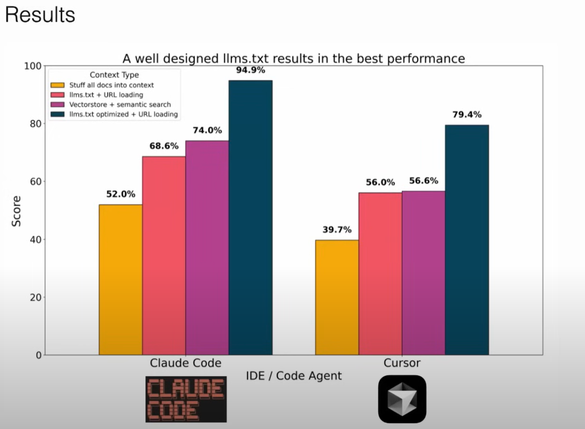
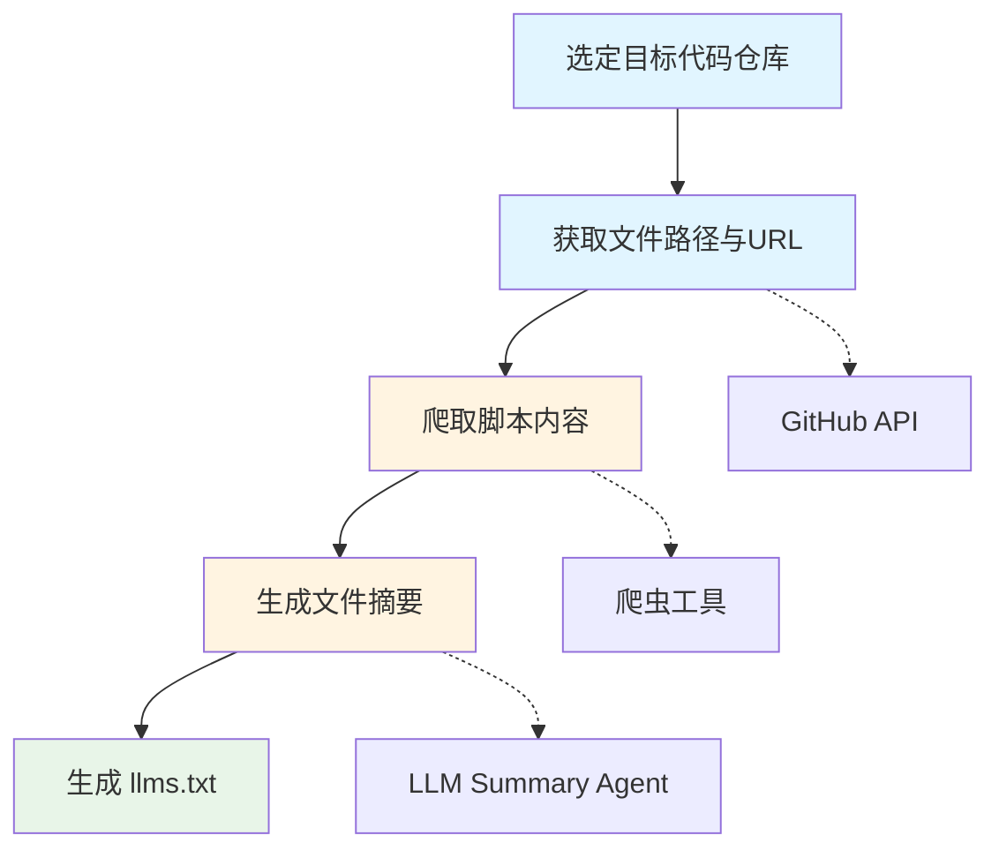

# Agent 设计经验总结2：使用LLMs.txt进行 Codebase Indexing的 Context Engineering 的设计总结

## 引言

近期，我聚焦于**Coding Agent**的记忆优化领域展开深度探索。作为典型的 React Agent，Coding Agent 能依托现有工具逐步推进任务解决流程，但在处理复杂的长上下文任务时，易出现 “幻觉” 问题，导致结果错误或远超context limit而造成任务失败。因此，**Context Engineering（上下文工程）** 对提升 Coding Agent 性能至关重要。

此前，我观看了 Latent Space 的技术分享会，会上提出的多项 Context Engineering 优化策略极具启发。本文将围绕**代码仓库检索（Retrieval）** 这一核心环节，系统阐述我的理解与实践思考，并在文末附上基于该思路的实现代码仓库链接，供大家参考。

## 检索（Retrieval）机制

检索是context engineering的一种策略，检索的核心是 “精准获取目标信息”，针对不同任务场景，其策略与实现方式存在显著差异：

* **外部文档库检索**：通常采用 RAG（检索增强生成）的语义召回策略(更进一步还有rerank，多路召回等策略，这里不详细解释)。通过指定编码模型对文档库内容分块进行离线向量编码，同时对用户查询做在线向量编码，最终通过相似度计算返回 Top K 个相关文档块。

* **搜索引擎检索**：设计 Agent 进行进行 Query Rewrite（查询重写）后触发搜索引擎进行搜索获得大量网页信息，再通过 Filter Agent（过滤代理）对检索结果进行质量评估，筛选出高价值信息。

* **代码仓库检索**：需通过**Codebase Indexing（代码库索引）** 机制实现高效信息提取。

在我的 Coding Agent 架构设计中，其被赋予**Supervisor Agent（监管代理）** 角色，内置丰富工具集 —— 既包含 Create File、Execute File 等基础工具，也涵盖各类 Subagent（子代理）工具（即 Agent as Tools）。该架构让 Coding Agent 专注于任务拆解与执行统筹，具体操作交由对应工具完成，实现 "分工明确、高效协作" 的任务管理模式。

目前，我为 Coding Agent 设计了两种核心检索形式：

1. 将 Search Agent 作为工具(可看我上一篇文章)，供 Coding Agent 在需要检索互联网文章时触发；

2. 在下载或读取代码仓库前，触发llm**s.txt Generator**生成索引目录文件作为supervisor的导航目录。

## Codebase Indexing：代码库索引的优化路径

**Codebase Indexing（代码库索引）** 的核心目标，是让 AI 辅助编程工具能根据用户需求快速定位相关代码片段，为编辑器中的 Agent 提供精准上下文。

### 1. 传统方案：基于 RAG 的代码库索引

传统代码库索引通常采用 RAG 技术，完整流程包含以下 6 个环节：

1. **文件扫描与预处理**：遍历项目目录，读取所有源代码文件，完成去冗余空白、统一编码格式等预处理操作。

2. **文本分块（Chunking）与元数据构建**：按行数、字符数或语义逻辑将文件拆分为 “块”（确保块长度适中且上下文完整），并为每个块附加文件路径、块长度等元数据。

3. **生成向量嵌入（Embedding）**：通过嵌入模型将代码块转换为固定维度向量，这是决定后续语义匹配效果的核心步骤。

4. **构建向量索引库**：将代码块向量与元数据存储到向量数据库或内存索引中，此步骤是为了避免在召回阶段速度过慢，质量换时间。(PS: 当然若代码仓库较小，使用暴力搜索进行召回也是一种不错的选择，这种方式质量最高)

5. **查询检索与排序**：将用户查询转换为向量后，在索引库中执行近似最近邻搜索，按相似度分数对结果排序并返回。

6. **结果整合与动态更新**：将检索到的代码块作为上下文传递给语言模型，同时设计实时更新（代码库修改后重新计算嵌入）与缓存策略，平衡索引准确性与响应速度。

在此基础上，还可通过**混合召回**（结合 GraphRAG 图谱、Rerank 重排序等技术）进一步提升检索准确率。

### 2. 优化方案：LLM.txt + 传统搜索工具的协同模式

当前，有一种更高效的代码库检索方案 ——**“LLM.txt + 传统搜索工具（grep/find）基于Agent 多轮工具调用来获得仓库所需要的信息**。

研究数据显示，采用 “LLM.txt + URL Reloading” 优化后，代码场景下的检索效果显著优于传统 RAG 方法。

## 核心概念：什么是 llms.txt？

从定义来看，传统 llms.txt 文件的核心作用是 “在推理阶段为 LLM 提供网站访问辅助信息”。它采用 Markdown 格式，兼具 “人类可读” 与 “LLM 可读” 特性，且格式规范统一。

基于这一思路，我将 llms.txt 的应用场景延伸至代码仓库：

llms.txt 可视为一份**代码库索引文档**，通过自然语言清晰描述代码仓库中每个文件（脚本、配置等）的内容与路径。其本质是 “人类与 LLM 通用的自然语言描述文件”，可存储为.md 或.txt 格式，核心价值是帮助 LLM 在推理时快速定位并访问所需的代码文件。

## 实践指南：如何构建代码仓库专属 llms.txt？

构建流程本质十分简单，核心分为 4 步，以下为具体操作路径：

1. **选定目标代码仓库**：确定需构建索引的代码仓库项目。

2. **获取文件路径与 URL**：通过 GitHub 访问工具，提取仓库内所有脚本的路径及对应的可下载 URL。

3. **爬取脚本内容**：使用爬虫工具批量获取所有脚本的完整内容。

4. **生成文件摘要**：通过 LLM 构建 Summary Agent，对每个脚本内容进行总结，最终整合成 LLM.txt 文件。

## 代码仓库地址

本文提及的 LLM.txt 生成工具及完整实现逻辑，已开源至 GitHub 仓库，仓库内包含详细 README 文档，可直接查看与复用。

访问链接：[https://github.com/mbt1909432/fast_llms_txt_generator)

## 📚 参考资料

(https://mp.weixin.qq.com/s/Ppk9KYi9XducDzKYTaGvtw)
(https://blog.csdn.net/i042416/article/details/145438638)
(https://www.youtube.com/watch?v=_IlTcWciEC4)
